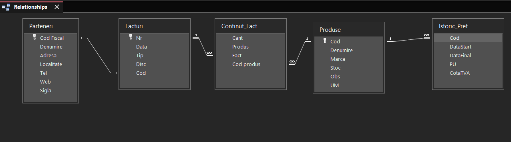

# Relational Database Implementation (MS Access) | Implementarea Bazelor de Date Relaționale

## 🇺🇸 EN / 🇷🇴 RO

### 🇺🇸 Project Overview
This project is an end-to-end Database Management System for a **Retail Store**, developed during the **Databases** course at **Babeș-Bolyai University (UBB)**. It demonstrates a complete transition from raw requirements to a functional desktop application.

**Full Technical Implementation:**
* **Database Schema:** Designed a normalized relational model including tables for *Products, Partners, Invoices, Invoice Details (Content),* and *Price History*.
* **Data Integrity:** Enforced primary/foreign keys and referential integrity with cascade rules.
* **Advanced SQL Logic:** Created complex queries for inventory tracking, VAT calculations, and discount management.
* **User Interface:** Developed interactive Forms (including sub-forms for invoice lines) and Switchboards for navigation.
* **Business Intelligence:** Automated Reports for generating Invoices, Sales Balances, and Partner Activity Logs.

---

### 🇷🇴 Prezentarea Proiectului
Acest proiect reprezintă un Sistem de Gestiune a Bazelor de Date pentru un **Magazin**, dezvoltat în cadrul cursului de **Baze de Date** la **Universitatea Babeș-Bolyai (UBB)**. Demonstrează tranziția completă de la cerințe brute la o aplicație funcțională.

**Implementare Tehnică Completă:**
* **Schema Bazei de Date:** Proiectarea unui model relațional normalizat (Produse, Parteneri, Facturi, Conținut Factură, Istoric Preț).
* **Integritatea Datelor:** Implementarea cheilor primare/externe și a integrității referențiale cu reguli de actualizare/ștergere în cascadă.
* **Logică SQL Avansată:** Crearea de interogări complexe pentru urmărirea stocurilor, calcularea TVA-ului și gestionarea discount-urilor.
* **Interfață Utilizator:** Dezvoltarea de formulare interactive (inclusiv sub-formulare pentru liniile de factură) și meniuri de navigare.
* **Rapoarte de Business:** Generarea automată de facturi, balanțe de vânzări și log-uri de activitate pentru parteneri.

---

### 🖼️ Database Schema / Diagrama Relațiilor

*Developed by Iulia-Raluca Vișan | Business Information Systems Student at UBB*
